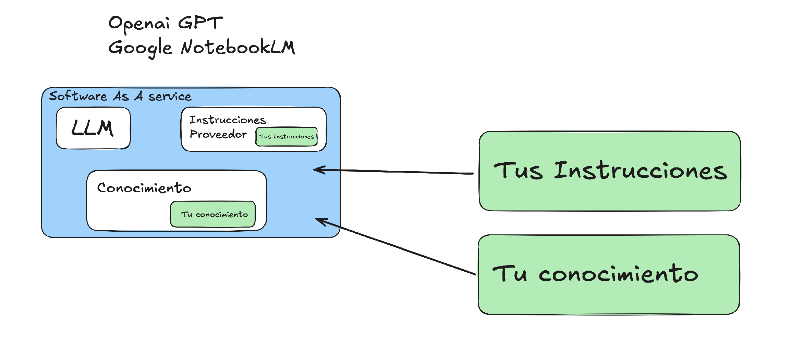
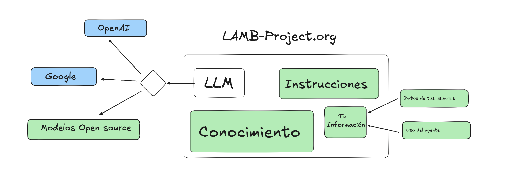

# Què necessites per crear un assistent / agent IA



Quan decideixes crear un assistent d'intel·ligència artificial per a educació o altres usos, necessites tres elements bàsics: un model de llenguatge (LLM), un conjunt d'instruccions (prompts) i una base de coneixement específica per evitar al·lucinacions i proporcionar informació precisa en el to adequat.

## El problema amb les solucions comercials

És cert que fer servir serveis com OpenAI o Google és còmode: no instal·les res i funciona directament.

Però mirem més de prop què passa realment:

### El que no t'expliquen

- **El proveïdor té les seves pròpies instruccions**, que no comparteix amb tu, i els teus prompts són només una petita part del sistema

- **El teu coneixement es queda amb el proveïdor** — informació que potser és confidencial

- **Les dades dels teus usuaris són processades per tercers** — totes les preguntes, interaccions i patrons d'ús

- **No tens registres complets** de com s'utilitza el teu assistent

Recordes el cas del mode privat de Chrome? Google va ser condemnat a esborrar informació que suposadament era privada però s'estava recopilant. Aquest és el tipus de problemes que volem evitar.

## Preguntes que t'has de fer

Quan vulguis triar la teva estratègia de creació i desplegament d'assistents basats en IA, especialment en educació, hauries de preguntar-te:
- Com proteges la privacitat dels teus usuaris?
- Com asseguraves la consistència del comportament? Com sabràs si el proveïdor canvia alguna cosa?
- Com proteges la confidencialitat de la teva informació?
- Saps realment com s'utilitza el teu assistent? Tens accés a les dades o les has regalat?
- Compleixes el RGPD?

## LAMB: Programari lliure per mantenir el control

[LAMB (Learning Assistant Manager and Builder)](https://lamb-project.org) és un projecte de programari lliure desenvolupat per Marc Alier i Juanan Pereira, investigadors de la UPC i la UPV/EHU, que canvia completament l'enfocament.

### Com funciona LAMB

Amb LAMB, tot s'executa a la teva pròpia infraestructura:

- Les instruccions són únicament les que tu defineixes
- El coneixement és el que tu aportes
- Les dades dels teus usuaris es queden al teu sistema
- Tens registres complets de l'ús

I aquí ve l'interessant: **tu tries el LLM**. Pots fer servir OpenAI, Google, Mistral o models de codi obert. Fins i tot pots canviar d'un a l'altre quan vulguis, o implementar filtres per evitar que dades confidencials surtin de la teva organització.

El projecte és de codi obert i està disponible a [lamb-project.org](https://lamb-project.org).
