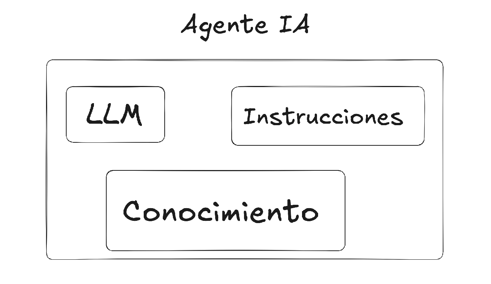
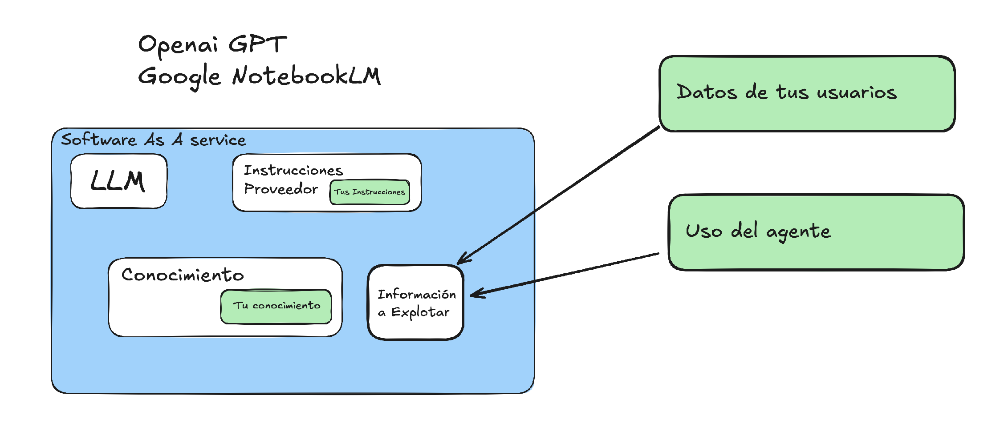

# What you need to build an AI assistant / agent



When you decide to build an artificial intelligence assistant for education or other uses, you need three basic elements: a language model (LLM), a set of instructions (prompts), and a specific knowledge base to avoid hallucinations and provide accurate information in the right tone.

## The problem with commercial solutions

It's true that using services like OpenAI or Google is convenient: you install nothing and it just works.

But let's take a closer look at what's actually happening:

### What they don't tell you

- **The provider has its own instructions** that it doesn't share with you, and your prompts are only a small part of the system

- **Your knowledge stays with the provider** — information that may well be confidential

- **Your users' data is processed by third parties** — every question, interaction, and usage pattern

- **You don't have complete records** of how your assistant is being used

Remember the Chrome private-mode case? Google was ordered to delete information that was supposedly private but was in fact being collected. That's exactly the kind of problem we want to avoid.

## Questions you should ask yourself

When choosing your strategy for building and deploying AI-based assistants, especially in education, you should ask:
- How do you protect your users' privacy?
- How do you ensure consistent behavior? How will you know if the provider changes something?
- How do you protect the confidentiality of your information?
- Do you actually know how your assistant is being used? Do you have access to the data, or did you give it away?
- Are you GDPR compliant?

## LAMB: Free software to keep you in control

[LAMB (Learning Assistant Manager and Builder)](https://lamb-project.org) is a free-software project developed by Marc Alier and Juanan Pereira, researchers at UPC and UPV/EHU, that changes the approach entirely.

### How LAMB works

With LAMB, everything runs on your own infrastructure:

- The instructions are only the ones you define
- The knowledge is the knowledge you provide
- Your users' data stays on your system
- You have complete usage records

And here's the interesting part: **you choose the LLM**. You can use OpenAI, Google, Mistral, or open-source models. You can even switch between them whenever you want, or put filters in place to keep confidential data from leaving your organization.

The project is open source and available at [lamb-project.org](https://lamb-project.org).
