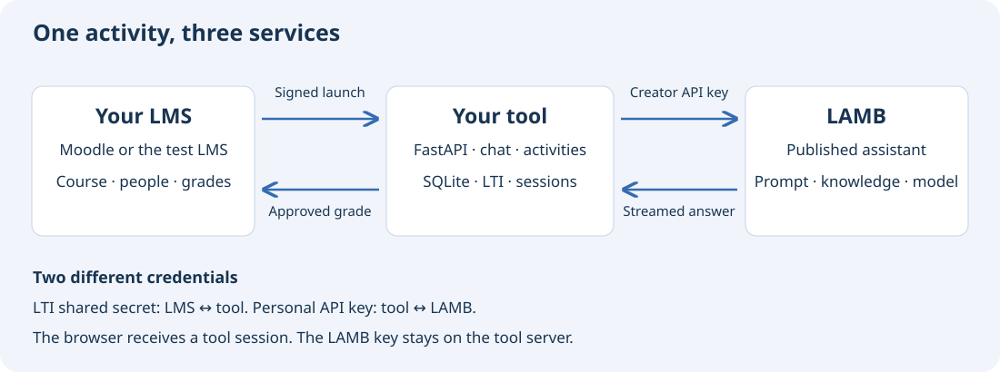
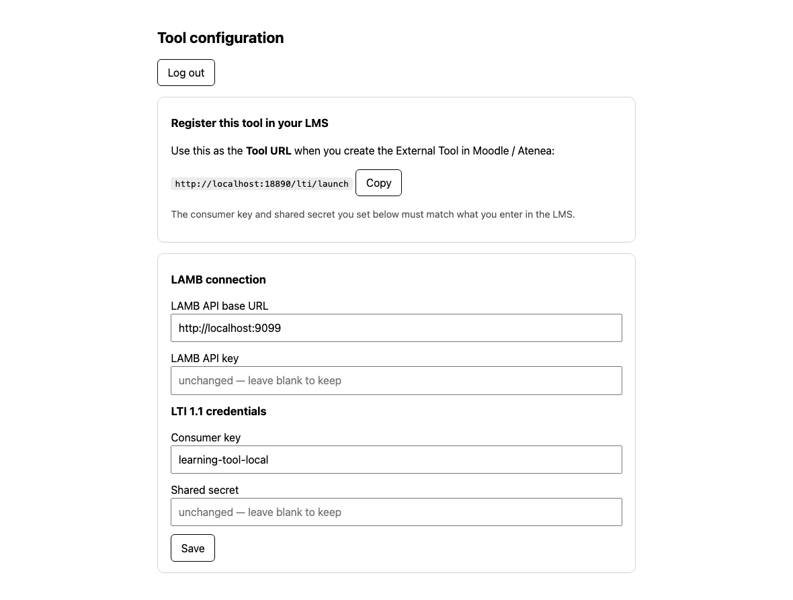
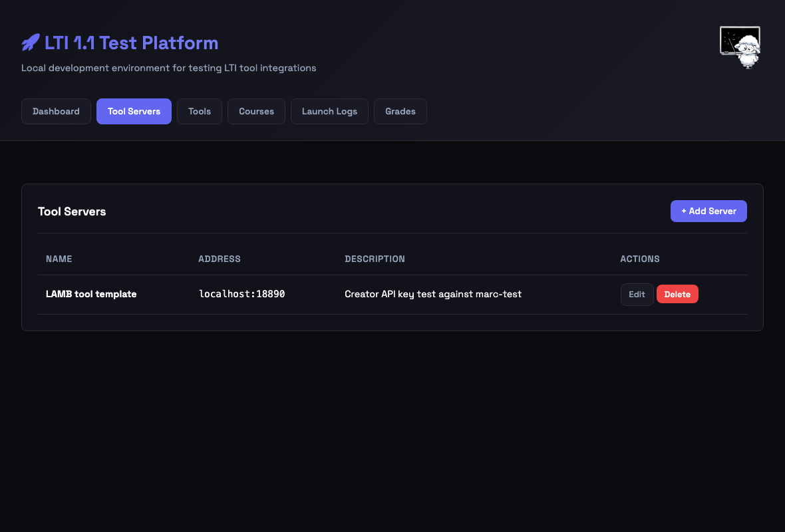
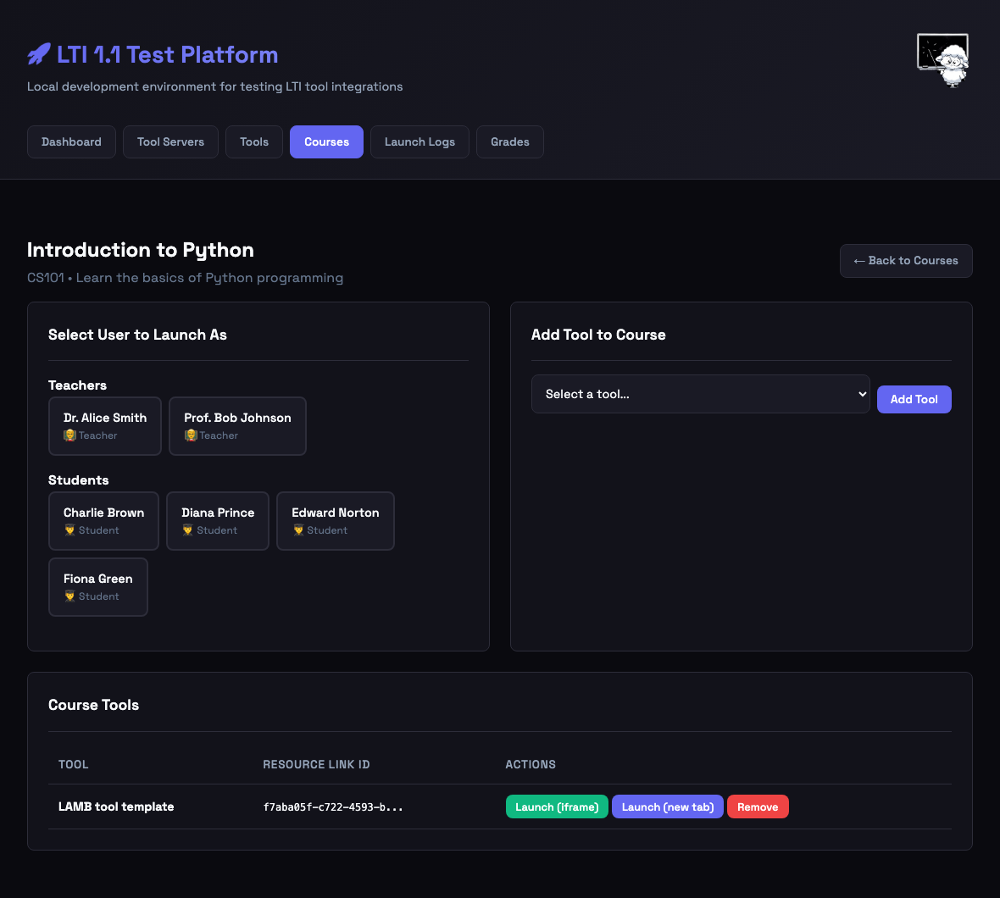
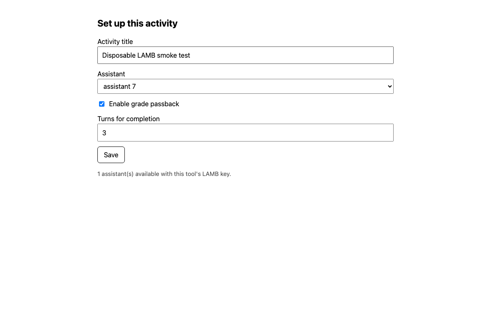
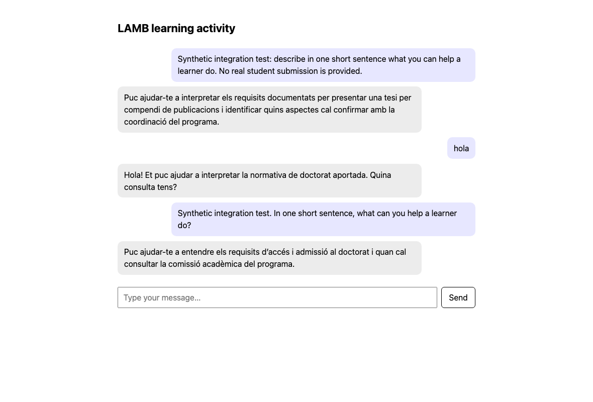
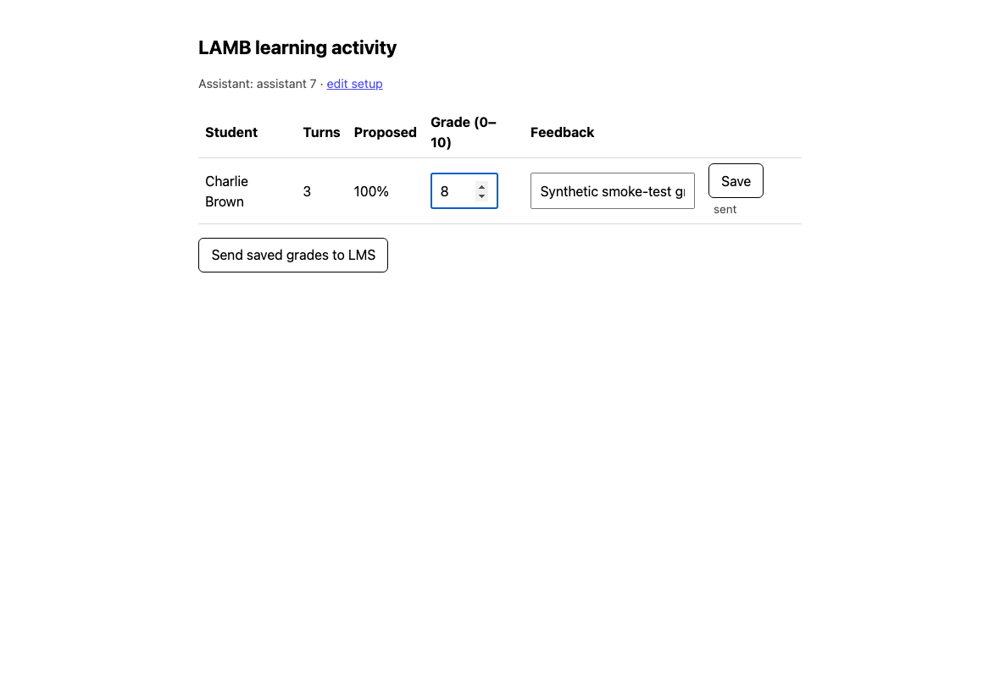
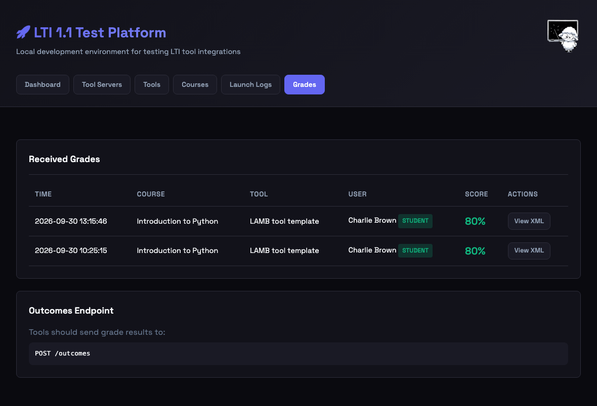
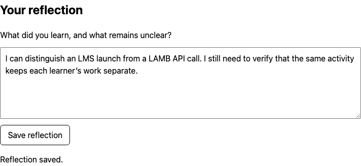

# Build an LTI tool with LAMB

Deploy a small educational application, launch it from an LMS, and use a LAMB assistant as its AI engine. This guide takes you through a working chat activity, instructor setup, student participation, and grade return. Then you will add a saved student reflection to make the application your own.

**Who this is for:** developers and teaching-innovation teams comfortable with a terminal and basic Python. An instructor can configure activities once the service is deployed.

**What you need:** a LAMB deployment with personal creator API keys enabled, at least one published assistant available to that creator, Python 3.11 or newer, Git, and a browser. The container deployment also needs Docker Compose. An actual LMS deployment needs an HTTPS hostname and permission to configure an LTI 1.1 External Tool.

**Version checked:** template [`c8c6f2f`](https://github.com/Lamb-Project/lamb-tool-template/tree/c8c6f2fecc4a55da8e67574ce5857270552a7db5), 30 September 2026. The local flow was verified using the [LAMB LTI Test Tool](https://github.com/Lamb-Project/lamb-lti-test-tool), a creator personal key, a streamed answer, and grade passback. The real-Moodle steps below are deployment instructions; this walkthrough does not claim a live Moodle acceptance test. Older LAMB installations may need an upgrade before the API-key controls exist.

Screenshots use seeded demo users; activity labels and connection addresses have been standardized for publication. Select an image to open it at full size.

[Template source](https://github.com/Lamb-Project/lamb-tool-template) · [Test LMS source](https://github.com/Lamb-Project/lamb-lti-test-tool) · [LAMB user manual](/en/manual/)

## In this guide

1. [Understand the connections](#1-understand-the-connections)
2. [Prepare LAMB and create a key](#2-prepare-lamb-and-create-a-key)
3. [Run the tool locally](#3-run-the-tool-locally)
4. [Configure the tool](#4-configure-the-tool)
5. [Launch through the test LMS](#5-launch-through-the-test-lms)
6. [Configure, chat, and return a grade](#6-configure-chat-and-return-a-grade)
7. [Run repeatable tests](#7-run-repeatable-tests)
8. [Deploy behind HTTPS and connect Moodle](#8-deploy-behind-https-and-connect-moodle)
9. [Operate and troubleshoot](#9-operate-and-troubleshoot)
10. [Extend the application](#10-extend-the-application)
11. [Contribute your changes](#11-contribute-your-changes)

## 1. Understand the connections

[](architecture.svg)

The template is a **separate application**. LAMB manages the assistant, its prompt, knowledge sources, and model connection. Your application manages the learning interaction and its own activity data. The LMS provides the signed user/role context and receives grades.

| Connection | Credential | Where you configure it |
|---|---|---|
| Administrator → tool | Tool admin username and password | Tool environment |
| Tool → LAMB | Creator personal API key | Tool `/admin` page |
| LMS → tool, and tool → LMS grade return | LTI consumer key and shared secret | Identical values in tool `/admin` and LMS tool registration |
| Student browser → tool | Session created after a verified LTI launch | Automatic; students do not need the creator key |

Do not interchange the LAMB key and LTI shared secret. They protect different connections.

The current template implements **LTI 1.1**, including Basic Outcomes grade passback. It is not an LTI 1.3/OIDC implementation. Check that your institution allows the version you intend to use.

### Local addresses used here

| Service | Example address | Purpose |
|---|---|---|
| Your existing LAMB instance | `http://localhost:9099` | Creator UI and OpenAI-compatible facade |
| New tool | `http://localhost:18890` | Admin, launch, setup, chat, dashboard |
| New test LMS | `http://localhost:18802` | Demo courses, signed launches, grade receiver |

Replace the LAMB address with your actual deployment. Keep `localhost` versus `127.0.0.1`, the port, scheme, and launch path consistent in the tool and LMS configuration: these affect the LTI signature.

## 2. Prepare LAMB and create a key

### 2.1 Enable personal API keys for the organization

An organization administrator opens **Org Admin → Settings → General**. Below Signup Settings, find **Personal API keys for creators**, check **Allow creators to create personal API keys**, and click **Save**.

Refresh LAMB. The **API keys** navigation item appears only when the organization permits it. If you are a creator without administration rights, ask your organization administrator to enable it. If the section itself is absent, check whether your LAMB deployment includes the personal API-key feature.

### 2.2 Prepare a published assistant

Create and test an assistant in **Learning Assistants**, then publish it. A key can access the published assistants you own or that are explicitly shared with you within your organization. An unpublished draft will not appear in the tool's picker.

For a first test, use a text assistant with a working model connection. Test its response in LAMB before diagnosing your new application.

### 2.3 Create a personal key

Open **API keys**, enter a useful label such as `course-tool-staging`, optionally set an expiry, and click **Create key**. Copy the key immediately: LAMB displays the full value only once. Store it in your password manager until you paste it into the tool's admin page.

Use a separate key for each deployment so you can revoke or rotate one independently. Disabling organization API access stops its existing keys; an expired or revoked key also stops the application from calling LAMB.

### 2.4 Check the API before continuing

The tool calls these endpoints:

```text
GET  /v1/models
POST /v1/chat/completions
Authorization: Bearer <creator-personal-key>
```

After installing the Python dependencies in the next step, this small probe asks for the key without echoing it or putting it into shell history:

```bash
python - <<'PY'
import getpass
import httpx
base = input('LAMB base URL: ').strip().rstrip('/')
key = getpass.getpass('Creator API key: ')
r = httpx.get(base + '/v1/models',
              headers={'Authorization': 'Bearer ' + key}, timeout=30)
r.raise_for_status()
for model in r.json()['data']:
    print(model['id'])
PY
```

**Expected:** at least one identifier such as `lamb_assistant.7`. An empty list means the key authenticated but has no visible published assistant. A 401/403 response points to credentials, expiry, account status, or organization access. Use the returned identifier, not the assistant's display name, in API calls.

## 3. Run the tool locally

This native-Python path puts the tool and test LMS on the same machine, making callback URLs straightforward. Use a disposable learning activity and synthetic users for testing.

### 3.1 Download and install

```bash
git clone https://github.com/Lamb-Project/lamb-tool-template.git
cd lamb-tool-template
python3 -m venv .venv
source .venv/bin/activate
python -m pip install -r requirements.txt
cp .env.example .env
chmod 600 .env
```

Check `python3 --version` first; use `python3.12` or your installed compatible version if the system default is older than 3.11. On Windows, use the corresponding virtual-environment activation command.

For reproducible deployment, record `git rev-parse HEAD`. This guide was checked against the revision linked above; review subsequent changes when updating.

### 3.2 Set boot configuration

Open `.env` in an editor:

```dotenv
ADMIN_USERNAME=tool-admin
ADMIN_PASSWORD=REPLACE_WITH_A_GENERATED_PASSWORD
PUBLIC_BASE_URL=http://localhost:18890
TOOL_DB_PATH=data/tool.db
SESSION_HOURS=8
ADMIN_SESSION_HOURS=12
```

Generate a password with `python -c 'import secrets; print(secrets.token_urlsafe(32))'` and replace the placeholder. Do not use the example text as a password. `.env` is local configuration and must stay outside Git.

`PUBLIC_BASE_URL` is the address **the browser/LMS uses to reach the tool**, not the LAMB address. The launch endpoint will be `http://localhost:18890/lti/launch`.

### 3.3 Start the server

From the template repository root, with the virtual environment activated:

```bash
uvicorn app.main:app --env-file .env --host 127.0.0.1 --port 18890
```

Keep this terminal running. `--env-file` explicitly loads `.env`; merely creating the file does not make Python read it. The working directory matters because template and static-file paths are relative.

In another terminal:

```bash
curl --fail http://localhost:18890/healthz
```

**Expected:** `{"status":"ok"}`. This confirms the application is running, not that the LAMB credentials or LMS registration are correct.

Open `http://localhost:18890/admin`. A direct visit to `/chat` is not a student login; student sessions start with a signed launch from the LMS.

## 4. Configure the tool

Log in to `/admin` with the credentials from `.env`. Fill in:

| Field | Value |
|---|---|
| LAMB API base URL | Your LAMB root, for example `http://localhost:9099` |
| LAMB API key | Your creator personal key |
| Consumer key | A label such as `learning-tool-local` |
| Shared secret | A new generated secret, separate from the API key and admin password |

**Do not append `/v1` to the LAMB API base URL.** `app/lamb_client.py` appends `/v1/models` and `/v1/chat/completions` itself.

Click **Save**. Copy the displayed Tool URL and retain the LTI consumer key and shared secret for the LMS registration.

[](01-tool-admin.png)

*Figure 1. The actual admin screen. Example labels and the LAMB address have been substituted for publication; secrets are not displayed.*

Runtime settings are stored in `data/tool.db`. Secret inputs are write-only: a blank secret field on later saves preserves its current value. You can optionally pre-seed these settings with `LAMB_API_BASE`, `LAMB_API_KEY`, `LTI_CONSUMER_KEY`, and `LTI_SECRET` environment variables, but **saved database values take precedence**. Editing a seed value in `.env` will not rotate a credential already stored in the database. Use `/admin` instead.

## 5. Launch through the test LMS

### 5.1 Start the LAMB LTI Test Tool

In a separate directory and terminal:

```bash
git clone https://github.com/Lamb-Project/lamb-lti-test-tool.git
cd lamb-lti-test-tool
python3 -m venv .venv
source .venv/bin/activate
python -m pip install -r requirements.txt
uvicorn app:app --host 127.0.0.1 --port 18802
```

Open `http://localhost:18802`. The tester seeds demo courses, teachers and students on first startup. It is a development mock LMS, so keep it on loopback and use synthetic data.

### 5.2 Add a tool server

Open **Tool Servers** and add:

| Field | Value |
|---|---|
| Name | `LAMB tool template` |
| Domain | `localhost` |
| Port | `18890` |
| Description | Optional description of this test deployment |

[](02-tool-server.png)

*Figure 2. The server entry describes where the tool is reachable.*

### 5.3 Register the tool

Open **Tools** and add a tool using that server:

- Name: `LAMB learning activity`.
- Launch path: `/lti/launch`.
- Consumer key: the same value saved in the tool admin console.
- Consumer secret: the same shared secret saved there.

The domain and port belong to the tool, not to LAMB or the test LMS. Save the registration.

### 5.4 Add it to a demo course

Open **Courses → Introduction to Python** and add your registered tool. This creates a course placement with its own `resource_link_id`. The demo course name does not constrain the topic of your assistant.

[](03-course-launches.png)

*Figure 3. Select a person first, then use the course tool’s launch button. Use a teacher for setup and a student for chat. The people shown are seeded demo users.*

The tester creates the signed form and POSTs it to the launch URL. Do not copy the resulting `?session=...` URL into teaching material or bookmark it as a permanent entry point. Relaunch from the course instead.

## 6. Configure, chat, and return a grade

### 6.1 Instructor first launch

Under **Select User to Launch As**, select a teacher, for example Dr. Alice Smith. Then click **Launch (new tab)** in the course tool row. On a new placement, the tool opens **Set up this activity**.

1. Enter an activity title.
2. Select an assistant from the live LAMB list.
3. Check **Enable grade passback** if you want this test to return a grade.
4. Set **Turns for completion**, for example `3`.
5. Click **Save**.

[](04-activity-setup.png)

*Figure 4. The picker is populated through the configured creator key. The current facade may show a label such as “assistant 7” rather than the assistant's name.*

The instructor reaches the dashboard. Later instructor launches return there; **edit setup** reopens the configuration.

“Turns for completion” produces a participation proposal: user turns divided by the configured threshold, capped at 100%. Zero disables that proposal. It does not judge answer quality and does not automatically submit grades.

### 6.2 Student launch and chat

Use a separate browser profile or private window for the student, especially in local tests. In the course, select a demo student such as Charlie Brown, then click **Launch (new tab)**. The tool opens the activity's chat.

Send a harmless test question, for example: “In one short sentence, what can you help a learner do?” Wait for the complete response. The browser calls your tool; the tool calls LAMB with its server-side key. The messages are stored in the tool database.

[](05-student-chat.png)

*Figure 5. A real response through the personal-key API. This example assistant answers in Catalan; your assistant's language and behavior come from its LAMB configuration.*

Relaunch the same student and confirm that the conversation is retained. A student who arrives before instructor setup sees the waiting page; configure the activity and relaunch.

### 6.3 Review and return a test grade

Relaunch as instructor. The dashboard lists learners who launched the activity, their recorded turns, and the participation proposal. This is not a full LMS roster synchronization.

1. Find the test student's row.
2. Enter `8` in **Grade (0–10)** and enter feedback.
3. Click the row's **Save** button.
4. Click **Send saved grades to LMS**.
5. Confirm `Sent 1. Failed 0.` for this single-student test.

[](06-instructor-grade.png)

*Figure 6. The grade-entry step. Saving a grade and sending it to the LMS are separate actions.*

Open the tester's **Grades** page. The tester should display **80%**, representing the normalized result **0.8**, equivalent to 8/10.

[](07-lms-grade.png)

*Figure 7. Verify the receiving system, not just the tool's success message.*

**Known issue in the checked snapshot:** the dashboard reloads a stored normalized grade, such as `0.8`, directly into an input labeled 0–10. Before saving an existing grade again, enter the intended value on the 0–10 scale. Fix the display conversion before classroom grading: the template should display `p.score * 10`, while the database and outcome protocol retain 0–1 values. Include save → reload → save in your regression tests.

## 7. Run repeatable tests

### 7.1 Manual acceptance checklist

Run these checks on a disposable course before each deployment:

| Check | Expected result |
|---|---|
| Health endpoint | 200 and `status: ok` |
| LAMB model discovery | Only the creator's available published assistants |
| First instructor launch | Setup screen |
| Student before setup | Waiting page |
| Setup saved, then instructor relaunch | Dashboard with selected activity |
| Student prompt | Complete nonempty streamed answer, no error bubble |
| Same student relaunch | Its saved conversation is visible |
| Different student | Separate conversation |
| Learner opens instructor dashboard | Access denied |
| Missing or invalid launch signature | Launch rejected |
| Save 8/10 and send | Receiving LMS records 0.8 |
| Grade reload and resave | No factor-of-ten change; address the snapshot issue above |
| Service restart | Settings, activity and history survive |

A model response proves API connectivity, not educational quality. Evaluate the assistant's behavior and knowledge separately in LAMB.

### 7.2 Bundled launch-validation test

The template includes `tests/test_lti_launch.py`, which checks valid launches, forged signatures, role tampering, replayed nonces, stale timestamps, missing sessions, and the pre-setup learner route.

Run it against a test tool instance, not a live course. In the template directory, activate its virtual environment and run:

```bash
python - <<'PY'
import getpass, os, subprocess, sys
env = os.environ.copy()
env['TOOL_BASE'] = 'http://localhost:18890'
env['PUBLIC_BASE_URL'] = env['TOOL_BASE']
env['LTI_CONSUMER_KEY'] = input('LTI consumer key: ').strip()
env['LTI_SECRET'] = getpass.getpass('LTI shared secret: ')
subprocess.run([sys.executable, 'tests/test_lti_launch.py'],
               env=env, check=True)
PY
```

The shared secret here is the LTI secret, not your creator key. These values must match the settings saved in `/admin`. The script signs launches with synthetic identifiers; it does not reset the application database. The setup-page check also attempts to list LAMB models, so a working LAMB connection makes the result more useful.

### 7.3 Browser tests for the whole flow

The repository includes `tests/e2e_full.py`. In the checked revision it is a reference harness, **not a portable one-command test**: it hard-codes ports, checkout/database paths, credentials, and demo-user IDs; it also replaces an existing test placement. Adapt it only for a disposable environment.

For an existing placement, download this guide's [portable browser smoke test](smoke-test.mjs). It takes instructor/student launch URLs and a model identifier as inputs, needs no LAMB key in browser code, and does not remove a placement.

```bash
mkdir tool-browser-test
cd tool-browser-test
npm init -y
npm install --save-dev playwright
npx playwright install chromium
# Save smoke-test.mjs from the link above into this directory.

export TOOL_ORIGIN=http://localhost:18890
export TEACHER_LAUNCH='http://localhost:18802/launch/1?user_id=1'
export STUDENT_LAUNCH='http://localhost:18802/launch/1?user_id=3'
export ASSISTANT_MODEL=lamb_assistant.7
node smoke-test.mjs
```

Replace the placement/user IDs with those from your tester links, and the model with one returned by your key. The script saves screenshots in `artifacts/`, sends a synthetic prompt, assigns a synthetic 8/10 grade, and sends that grade to the test LMS. Use only a disposable placement. It checks the tool's passback result; finish by checking **Grades** in the receiving LMS for 0.8. Keep screenshots, logs and session URLs out of public repositories unless reviewed and sanitized.

## 8. Deploy behind HTTPS and connect Moodle

### 8.1 Prepare the production host

Choose a hostname such as `learning-tool.example.edu`, point DNS at your server, and arrange HTTPS through your institution's reverse proxy. The server must reach both LAMB and the LMS outcome endpoint. The learner's browser must reach the tool.

Use a separate production creator key, LTI secret, admin password, and database. Verify institutional support for LTI 1.1 before rollout. The template is a starting point; address the grade-display issue and review authentication, request limits, and deployment hardening before use with real learners.

### 8.2 Container deployment

Clone the repository on the server and create `.env` as in the local setup, with:

```dotenv
ADMIN_USERNAME=tool-admin
ADMIN_PASSWORD=REPLACE_WITH_A_NEW_GENERATED_PASSWORD
PUBLIC_BASE_URL=https://learning-tool.example.edu
```

The repository's default Compose file exposes port 8080. To bind the app only to the host reverse proxy, create a separate `compose.production.yaml` in the repository root:

```yaml
services:
  tool:
    build: .
    env_file: .env
    environment:
      TOOL_DB_PATH: /srv/tool/data/tool.db
    ports:
      - "127.0.0.1:18890:8080"
    volumes:
      - ./data:/srv/tool/data
    restart: unless-stopped
```

Run this file explicitly:

```bash
mkdir -p data
chmod 700 data
chmod 600 .env
docker compose -f compose.production.yaml up -d --build
curl --fail http://127.0.0.1:18890/healthz
```

The persistent `data/` mount holds settings, sessions, conversations and grades. Replacing the container must preserve this directory.

**Container networking:** `localhost` inside this container means the container itself. In `/admin`, use a LAMB URL reachable from the container, normally its HTTPS hostname. For Docker Desktop development, `host.docker.internal` can address a host service; on Linux an explicit host-gateway mapping may be needed. This does not change `PUBLIC_BASE_URL`, which remains the browser-facing tool URL. Local LMS callbacks have the same networking constraint. Use the native local path above for the simplest complete mock-LMS test.

### 8.3 Reverse proxy

For a host-installed Caddy reverse proxy, a minimal site block is:

```caddyfile
learning-tool.example.edu {
    reverse_proxy 127.0.0.1:18890 {
        flush_interval -1
    }
    header Referrer-Policy "no-referrer"
}
```

Adapt this to your institution's TLS setup. See the [Caddy reverse-proxy reference](https://caddyserver.com/docs/caddyfile/directives/reverse_proxy) for transport and streaming options. This example assumes Caddy runs on the same host, not in a separate container. Verify that `/healthz` and `/admin` work through HTTPS and that responses stream without proxy buffering. Make sure framing policy permits your LMS if you use embedded launches; start with a new-window launch to isolate iframe/cookie issues.

Session tokens can occur in query strings for iframe compatibility. Avoid logging full query strings, leaking them through referrers, or including third-party analytics on authenticated tool pages. The checked admin-cookie implementation should also be reviewed for production Secure-cookie policy, together with CSRF protection and login rate limits. These are deployment/engineering tasks, not settings a learner should need to manage.

### 8.4 Set runtime configuration

Open `https://learning-tool.example.edu/admin` and enter the production LAMB base URL, creator key, LTI consumer key, and shared secret. Save and copy the displayed launch URL:

```text
https://learning-tool.example.edu/lti/launch
```

### 8.5 Add the Moodle External Tool

Moodle labels and permissions vary by version and institution; consult the [Moodle External tool settings](https://docs.moodle.org/en/External_tool_settings) for your version. Add an **External tool** activity in a course, or ask a site administrator to create a reusable tool under **Site administration → Plugins → Activity modules → External tool → Manage tools**.

| Setting | Value or action |
|---|---|
| Tool URL | The HTTPS `/lti/launch` URL from the tool admin page |
| LTI version | LTI 1.0/1.1, where offered |
| Consumer key | Exact match to the tool's saved consumer key |
| Shared secret | Exact match to the tool's saved LTI secret |
| Launch container | New window for initial testing; embedded after verification |
| Name/email sharing | Configure according to institutional policy; shared names help identify the dashboard roster |
| Accept grades from the tool | Enable when using grade passback |
| Activity grade | Configure a grade type and maximum grade appropriate to the course |

The launch's stable user identifier and result identifier associate the learner and grade. Names/emails make the roster readable; do not substitute them for identity in your code. A maximum grade of 10 makes the local 0.8 test appear as 8/10; a different maximum scales the normalized result.

Launch as instructor, configure the assistant, then test with a dedicated learner account. Confirm both a complete response and the result in the Moodle gradebook. Test embedded mode separately if that is how the course will run. A successful mock-LMS test does not establish that institutional HTTPS, iframe policies, grade settings, or role mapping are correct.

## 9. Operate and troubleshoot

### Keep data and credentials recoverable

Back up `.env` and the SQLite database securely. The database contains the saved LAMB key and LTI secret as well as learner data. Restrict access to backups as you do to the live server.

For the container example, a simple maintenance-window backup is:

```bash
docker compose -f compose.production.yaml stop tool
mkdir -p backups
chmod 700 backups
umask 077
cp data/tool.db "backups/tool-$(date +%Y%m%d-%H%M%S).db"
docker compose -f compose.production.yaml start tool
```

Test restore against an isolated instance with the same code revision before relying on the backup. Keep credentials and backups outside version control. For updates, record the old revision, back up, review changes and any migration requirements, rebuild, and rerun launch/chat/grade checks. A code rollback alone cannot undo incompatible database changes.

To rotate a creator key, create its replacement in LAMB, save it in the tool admin console, test model discovery and a completion, then revoke the old key. For an LTI secret change, update both tool and LMS together and test a fresh launch.

### Troubleshooting table

| Symptom | Check first |
|---|---|
| App refuses to start | Required admin credentials and `PUBLIC_BASE_URL`; explicit `.env` loading; Python version |
| `/healthz` works but launch is rejected | All four runtime settings saved; matching LTI key/secret; exact public launch URL; clock skew |
| LAMB path contains `/v1/v1/` | Remove `/v1` from the configured base URL |
| Empty assistant picker | Assistant published; owned/shared access; organization API access; active creator key |
| Connection refused inside Docker | Use a container-reachable LAMB address; do not assume container localhost is the host |
| Student sees waiting page | Instructor has not configured this course placement |
| Chat starts but no answer arrives | Inspect tool and LAMB logs; test the assistant in LAMB; check provider and streaming timeouts |
| Session missing/expired | Relaunch from LMS; do not reuse old session URLs; check HTTPS and iframe behavior |
| Student absent from dashboard | Student must launch the activity first; this is not full roster import |
| `Sent 0` or passback failure | Grading enabled; saved unsent grade; learner launch supplied result/outcome fields; LMS callback reachable |
| Grade shown as 0.8 in a 0–10 input after reload | Snapshot display-conversion bug described in section 6; fix before real grading |
| Environment change seems ignored | Runtime settings in SQLite override environment seeds; update through `/admin` |

`docker compose -f compose.production.yaml logs --tail=100 tool` is useful for startup failures. Share sanitized diagnostics, never keys, full launch payloads, or session-bearing URLs.

## 10. Extend the application

### 10.1 Choose the right layer

Change the assistant's prompt, model, knowledge sources and rubric in **LAMB** when the educational change belongs to the assistant. Change the **tool** when you need a different interaction, saved activity state, submission workflow, or instructor view.

| File | Responsibility | Typical extension |
|---|---|---|
| `app/templates/chat.html`, `app/static/chat.js` | Learner interface and streaming display | Guided steps, response controls, accessible status messages |
| `app/routers/chat.py` | Authenticated chat and history | Input limits, structured activity flow, retrieval of tool-owned state |
| `app/lamb_client.py` | `/v1/models` and streamed `/v1/chat/completions` | Controlled request construction, timeouts and error reporting |
| `app/templates/setup.html`, `app/routers/instructor.py` | Activity settings, dashboard and grading | Per-activity options, richer review, assessment proposals |
| `app/db.py` | SQLite schema and persistence | Versioned migrations and scoped feature data |
| `app/sessions.py` | Session resolution and role checks | Reuse from every new protected endpoint |
| `app/lti/validation.py`, `app/lti/outcomes.py` | Launch validation and signed grade return | Preserve these module boundaries and their tests |

### 10.2 Worked example: save a student reflection

Suppose students should write a short reflection after chatting. Add a private, saved reflection first. It is not automatically sent to an AI model or used as a grade. The example reuses the authenticated session and scopes records by **user, course placement, and LMS consumer**.

Create `app/routers/reflection.py`:

```python
from fastapi import APIRouter, Request
from pydantic import BaseModel, Field
from .. import db, sessions

router = APIRouter()


def init_reflections():
    with db.get_conn() as conn:
        conn.execute('''
            CREATE TABLE IF NOT EXISTS reflections (
                user_id INTEGER NOT NULL,
                resource_link_id TEXT NOT NULL,
                consumer_guid TEXT NOT NULL,
                body TEXT NOT NULL,
                updated_at TEXT NOT NULL,
                PRIMARY KEY (user_id, resource_link_id, consumer_guid)
            )
        ''')


class Reflection(BaseModel):
    body: str = Field(min_length=30, max_length=4000)


def identity(session):
    return (session['user_id'], session['resource_link_id'],
            session['consumer_guid'])


@router.get('/reflection')
def read_reflection(request: Request):
    session = sessions.resolve_session(request)
    with db.get_conn() as conn:
        row = conn.execute('''
            SELECT body FROM reflections
            WHERE user_id=? AND resource_link_id=? AND consumer_guid=?
        ''', identity(session)).fetchone()
    return {'body': row['body'] if row else ''}


@router.post('/reflection')
def save_reflection(request: Request, reflection: Reflection):
    session = sessions.resolve_session(request)
    with db.get_conn() as conn:
        conn.execute('''
            INSERT INTO reflections
                (user_id, resource_link_id, consumer_guid, body, updated_at)
            VALUES (?, ?, ?, ?, ?)
            ON CONFLICT(user_id, resource_link_id, consumer_guid)
            DO UPDATE SET body=excluded.body, updated_at=excluded.updated_at
        ''', (*identity(session), reflection.body, db.now_iso()))
    return {'ok': True}
```

In `app/main.py`, import `reflection` alongside the existing routers. Add `reflection.init_reflections()` inside `_startup()` after `db.init_db()`, and register `app.include_router(reflection.router)` alongside the other routers. For later schema changes, introduce explicit, versioned migrations; `CREATE TABLE IF NOT EXISTS` only covers the initial addition.

Add this form inside the content block in `app/templates/chat.html`:

```html
<section aria-labelledby="reflection-heading">
  <h2 id="reflection-heading">Your reflection</h2>
  <form id="reflection-form">
    <label for="reflection-body">What did you learn, and what remains unclear?</label>
    <textarea id="reflection-body" required minlength="30"
              maxlength="4000" rows="5"></textarea>
    <button type="submit">Save reflection</button>
    <p id="reflection-status" role="status" aria-live="polite"></p>
  </form>
</section>
```

Load a new `/static/reflection.js` after the template assigns `window.SESSION_TOKEN`. Put the following in `app/static/reflection.js`:

```javascript
(async function () {
  const form = document.getElementById('reflection-form');
  const input = document.getElementById('reflection-body');
  const status = document.getElementById('reflection-status');
  const headers = { 'X-Session-Token': window.SESSION_TOKEN };
  try {
    const response = await fetch('/reflection', { headers });
    if (!response.ok) throw new Error('load');
    input.value = (await response.json()).body;
  } catch {
    status.textContent = 'Could not load your reflection. Relaunch and try again.';
  }
  form.addEventListener('submit', async (event) => {
    event.preventDefault();
    const button = form.querySelector('button');
    button.disabled = true;
    try {
      const response = await fetch('/reflection', {
        method: 'POST',
        headers: { ...headers, 'Content-Type': 'application/json' },
        body: JSON.stringify({ body: input.value }),
      });
      if (!response.ok) throw new Error('save');
      status.textContent = 'Reflection saved.';
    } catch {
      status.textContent = 'Could not save. Check the length and your session, then retry.';
    } finally {
      button.disabled = false;
    }
  });
})();
```

Add a small rule to `app/static/style.css` so the new input uses the available width:

```css
#reflection-body {
  display: block;
  width: 100%;
  font: inherit;
  padding: 0.6rem;
  margin-bottom: 0.75rem;
}
```

Restart the development server, or rebuild the container. Launch as a learner, enter at least 30 characters, save, and relaunch. The text should return. Check a second learner and a second course placement: neither should inherit the first learner's text. This sample permits any authenticated participant to save their own reflection; add a learner-only rule if your activity requires one.

[](08-reflection-extension.png)

*Figure 8. The reflection example running in an isolated test instance. Save and reload were verified in a browser.*

The client never submits a trusted `user_id`, role, course, or model identifier. Those come from the authenticated server-side session or saved activity. Use parameterized SQL and render user text as text, not raw HTML.

### 10.3 Extend assessment without removing instructor review

The starter `propose_completion_score()` counts participation. To add an AI-assisted rubric proposal, keep the distinction between a **proposal**, a **saved instructor decision**, and a **sent LMS result**. Store the evidence and rubric version behind each proposal. Validate model output and handle timeouts explicitly. Have instructors review before invoking grade passback.

Keep scores in 0–1 in storage and in the outcome protocol; convert at the 0–10 UI boundary. Test 0, 0.8, and 1 through save, reload, edit, send and receiving-gradebook readback.

### 10.4 Extension test contract

Every new feature should establish:

- Unauthenticated requests fail; learner requests cannot use instructor operations.
- Data stays scoped to the session's user, resource link and consumer GUID.
- Inputs have server-side limits and validation; invalid submissions do not corrupt stored work.
- State survives restart and the migration preserves earlier activities.
- Errors leave a useful recovery path; streaming failures do not silently count as completed learning work.
- Existing signed-launch, chat and grade-return behavior still works.

Do not weaken signature or replay checks to make a new screen easier to reach. Keep all LAMB credentials on the server. If users can choose among models, validate their choice against what the configured key can access and persist the choice as an instructor setting.

## 11. Contribute your changes

Develop in your own branch or fork. Include a description of the learning activity, setup instructions, screenshots with synthetic data, and tests for the new behavior. General improvements to the LTI boundary, sessions, persistence, and LAMB client can benefit other template users.

The [extension notes](https://github.com/Lamb-Project/lamb-tool-template/blob/c8c6f2fecc4a55da8e67574ce5857270552a7db5/docs/EXTENDING.md) describe a possible later integration into LAMB. That integration requires decisions about identity, storage and credentials; copying this standalone app into LAMB does not make it an integrated extension automatically.

Keep the template's GPL-3.0 license and attribution, and consult the repository's contribution discussion when preparing changes. Start with the [template repository](https://github.com/Lamb-Project/lamb-tool-template) for issues and pull requests.
