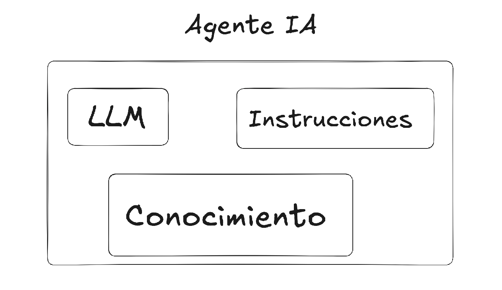
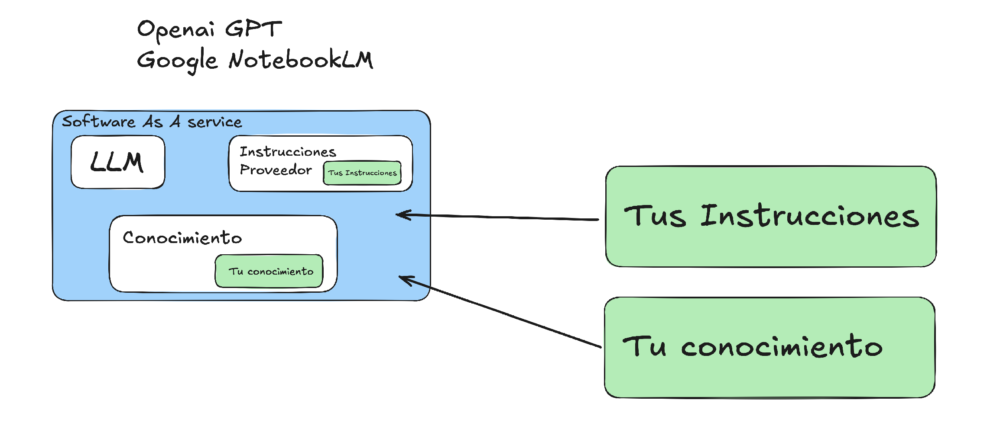
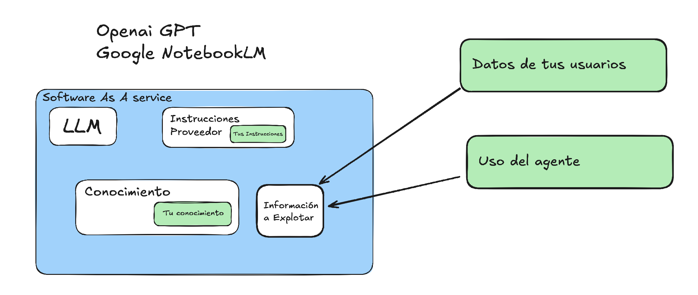
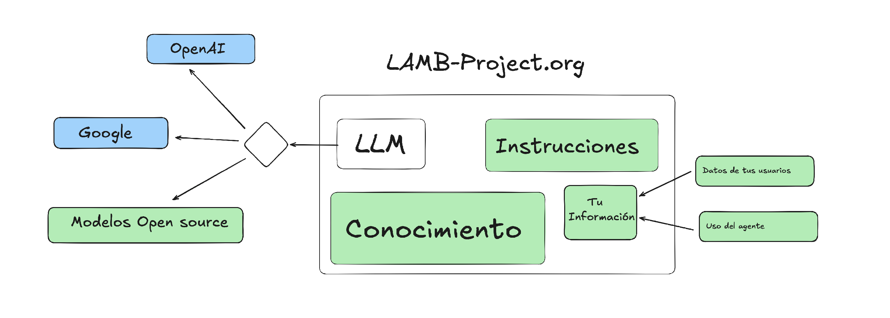

# Que necesitas para crear un asistente / agente IA



Cuando decides crear un asistente de inteligencia artificial para educación u otros usos, necesitas tres elementos básicos: un modelo de lenguaje (LLM), un conjunto de instrucciones (prompts) y una base de conocimiento específica para evitar alucinaciones y proporcionar información precisa en el tono adecuado.

## El problema con las soluciones comerciales

Es cierto que usar servicios como OpenAI o Google es conveniente: no instalas nada y funciona directamente. 

Pero miremos más de cerca lo que realmente ocurre:

### Lo que no te cuentan

- **El proveedor tiene sus propias instrucciones** que no comparte contigo, y tus prompts son solo una pequeña parte del sistema

- **Tu conocimiento se queda con el proveedor** - información que quizás es confidencial

- **Los datos de tus usuarios son procesados por terceros** - todas las preguntas, interacciones y patrones de uso

- **No tienes registros completos** de cómo se usa tu asistente

¿Recuerdas el caso del modo privado de Chrome? Google fue condenado a borrar información que supuestamente era privada pero estaba siendo recopilada. Ese es el tipo de problemas que queremos evitar.

## Preguntas que debes hacerte

Cuando quieres elegir tu estratégia de creación y despliegue de asistentes basados en IA, especialmente en educación, debas perguntarte:
- ¿Cómo proteges la privacidad de tus usuarios?
- ¿Cómo aseguras consistencia del comportamiento¿ Como vas a saber si el proveedor cambia algo?
- ¿Cómo proteges la confidencialidad de tu información?
- ¿Sabes realmente cómo se usa tu asistente? ¿Tienes acceso a los datos o los has regalado?
- ¿ Cumples la GDPR ?

## LAMB: Software libre para mantener el control

[LAMB (Learning Assistant Manager and Builder)](https://lamb-project.org) es un proyecto de software libre desarrollado por Marc Alier y Juanan Pereira, investigadores de la UPC y UPV/EHU que cambia completamente el enfoque.

### Cómo funciona LAMB

Con LAMB, todo se ejecuta en tu infraestructura:

- Las instrucciones son únicamente las que tú defines
- El conocimiento es el que tú aportas
- Los datos de tus usuarios se quedan en tu sistema
- Tienes registros completos del uso

Y aquí viene lo interesante: **tú eliges el LLM**. Puedes usar OpenAI, Google, Mistral o modelos open source. Incluso puedes cambiar de uno a otro cuando quieras, o implementar filtros para evitar que datos confidenciales salgan de tu organización.

El proyecto es opensource y está disponible en [lamb-project.org](https://lamb-project.org).

