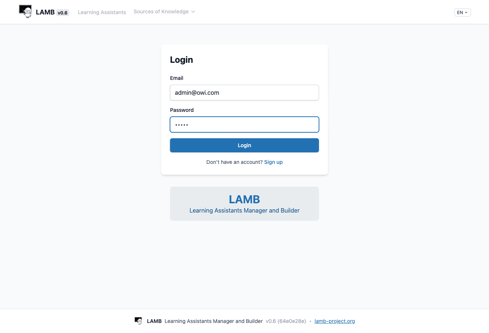
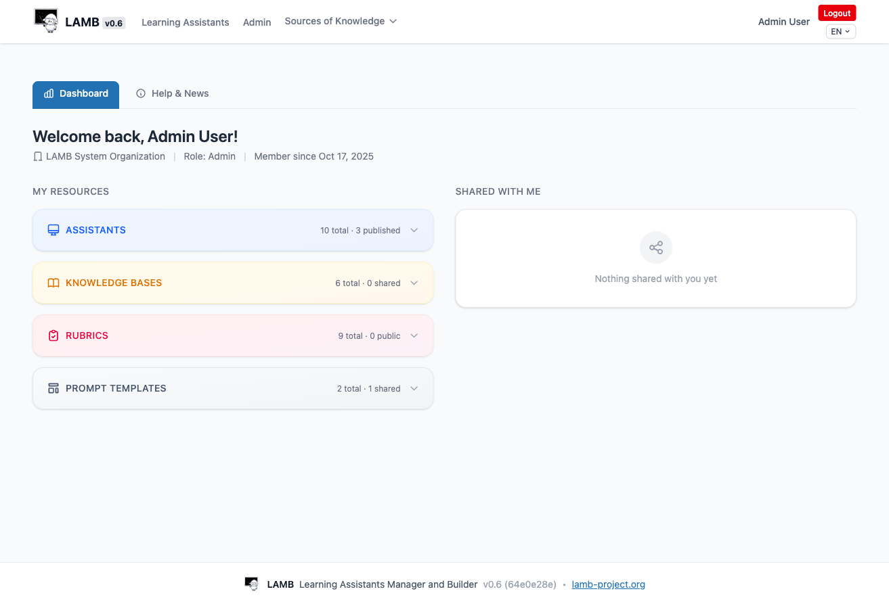
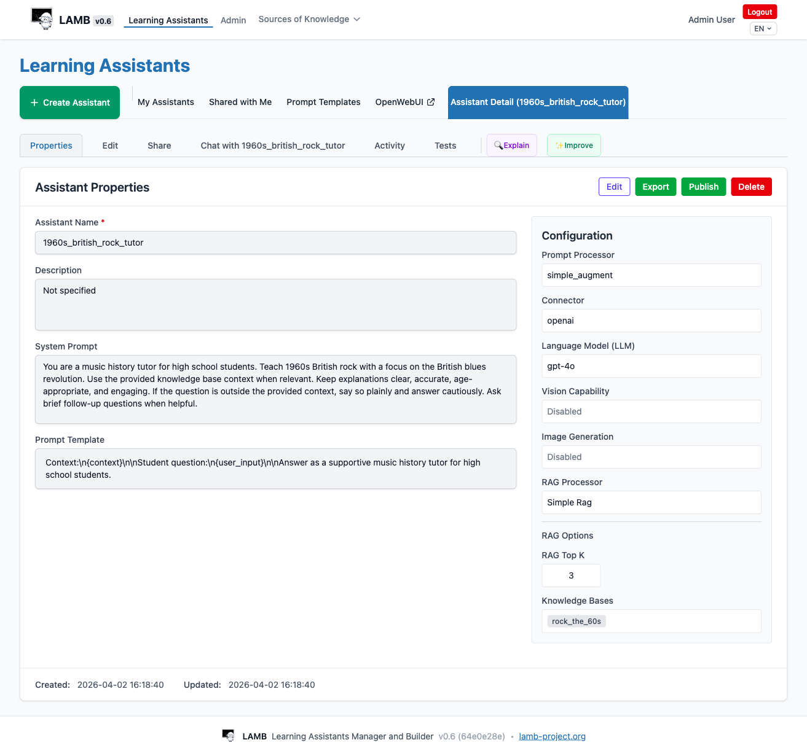
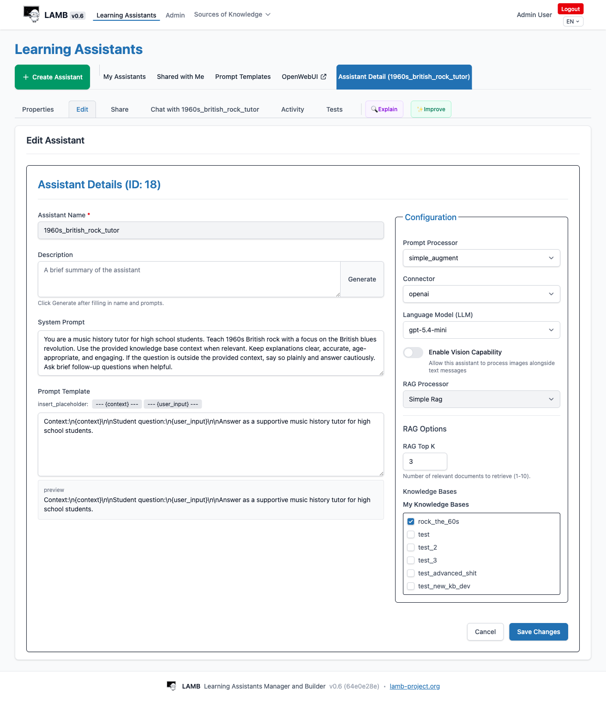
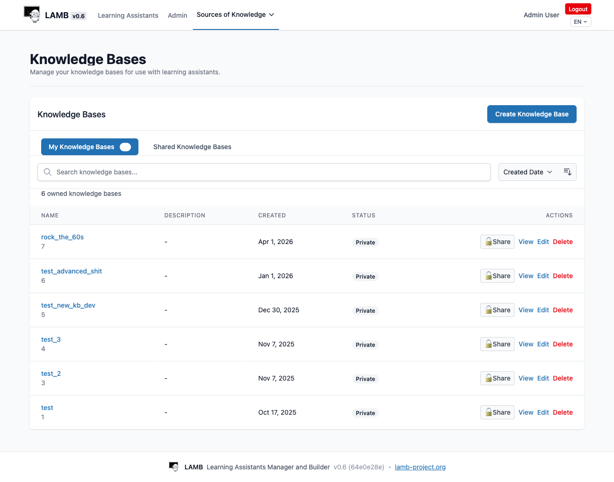
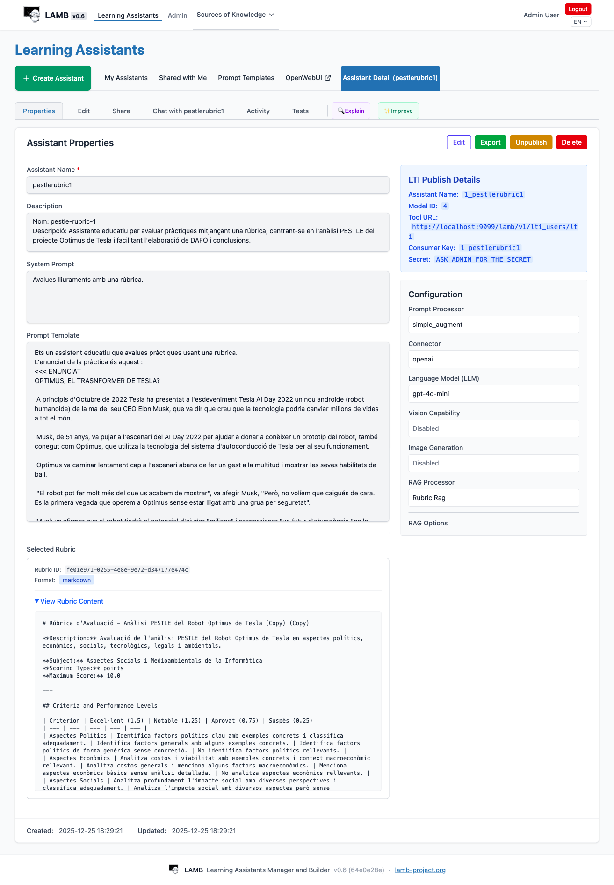
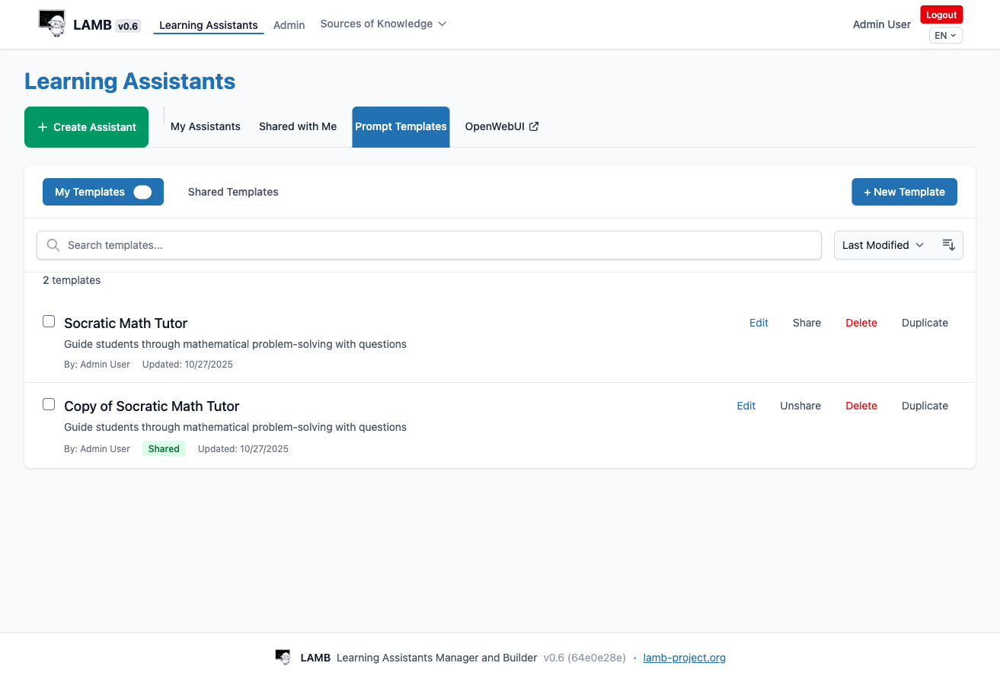
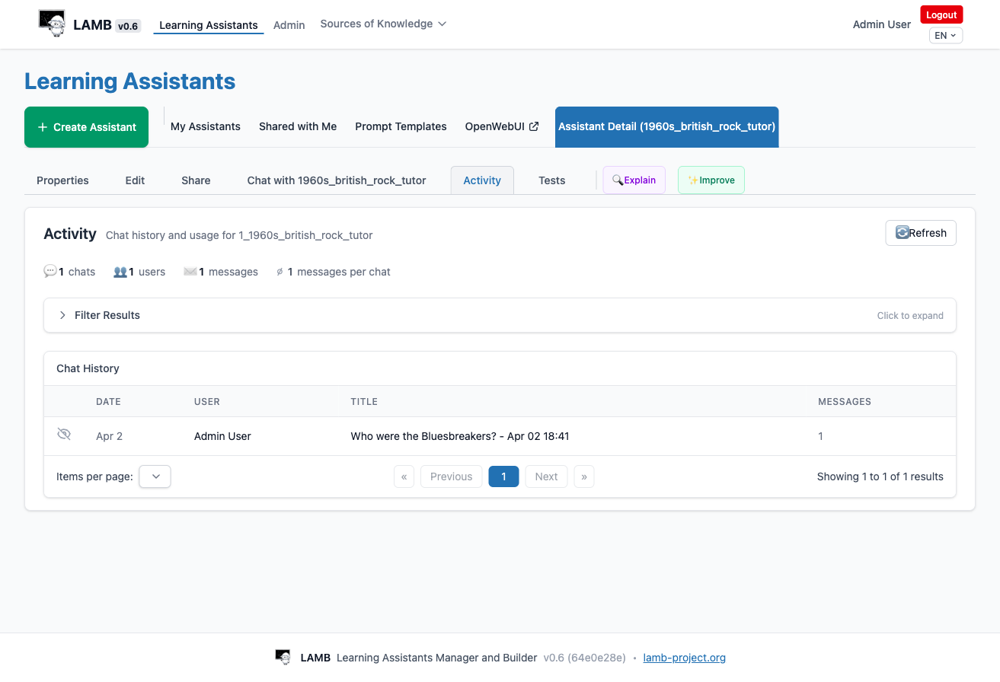

# Manual de Usuario de LAMB

> **Destinatarios**: Docentes y disenadores instruccionales que crean y gestionan asistentes de aprendizaje con IA mediante la plataforma LAMB. Este manual cubre desde el primer inicio de sesion hasta la publicacion de asistentes en su LMS.

---

## 1. Primeros pasos

### 1.1 Inicio de sesion

Abra la URL de su instancia LAMB en un navegador. Vera la pantalla de inicio de sesion.



Introduzca el **correo electronico** y la **contrasena** proporcionados por el administrador LAMB de su institucion y haga clic en **Login**.

Si su institucion ha habilitado el auto-registro, haga clic en **Sign up** y complete el formulario. Necesitara la **clave de registro** proporcionada por el administrador de su organizacion.

> **Acceso LTI**: Si su institucion ha configurado la integracion LTI Creator, puede acceder a LAMB directamente desde su LMS (Moodle, Canvas, etc.) sin un inicio de sesion separado. Su cuenta se crea automaticamente en el primer acceso.

### 1.2 El Panel de Control (Dashboard)

Tras iniciar sesion, accede al **Dashboard** — su pantalla principal.



El panel de control muestra:

- **Su nombre, organizacion y rol** (p. ej., Admin, Miembro)
- **Mis Recursos** — un resumen de todo lo que posee:
  - **Asistentes** — cuantos ha creado y cuantos estan publicados
  - **Bases de Conocimiento** — sus colecciones de documentos
  - **Rubricas** — rubricas de evaluacion que ha creado
  - **Plantillas de Prompt** — configuraciones de prompt reutilizables
- **Compartido conmigo** — recursos que otros docentes de su organizacion han compartido con usted

### 1.3 Navegacion

La barra de navegacion superior esta siempre visible:

| Elemento del menu | Que hace |
|-------------------|----------|
| **Learning Assistants** | Crear, editar, probar y publicar sus asistentes |
| **Sources of Knowledge** | Gestionar Bases de Conocimiento y Rubricas |
| **Admin** | Gestion de organizacion y usuarios (solo administradores) |
| **Selector de idioma** (EN/ES/CA/EU) | Cambiar el idioma de la interfaz |

---

## 2. Asistentes de Aprendizaje

Los asistentes son el nucleo de LAMB — tutores, evaluadores y companeros de aprendizaje impulsados por IA con los que sus estudiantes interactuan.

### 2.1 Ver sus Asistentes

Haga clic en **Learning Assistants** en la barra de navegacion. La pestana **My Assistants** muestra todos los asistentes que usted posee.


Para cada asistente, la lista muestra:

- **Nombre** y **estado de publicacion** (Published / Unpublished)
- **Descripcion**
- **Fechas de creacion y ultima actualizacion**
- **Configuracion tecnica** — el procesador de prompt, conector, modelo LLM y procesador RAG
- **Acciones** — Ver (icono de ojo), Exportar (icono de descarga), Eliminar (icono de papelera)

Puede **buscar** por nombre o descripcion, **filtrar** por estado (Todos, Publicados, No publicados) y **ordenar** por distintos criterios.

### 2.2 Crear un Asistente

Haga clic en el boton **+ Create Assistant**. Aparece el formulario de creacion.


Complete los siguientes campos:

#### Informacion basica

| Campo | Descripcion | Obligatorio |
|-------|-------------|-------------|
| **Assistant Name** | Un nombre unico (max. 20 caracteres). Los espacios y caracteres especiales se convierten en guiones bajos. | Si |
| **Description** | Un breve resumen de lo que hace el asistente. Haga clic en **Generate** para generar automaticamente a partir del nombre y el prompt del sistema. | No |
| **System Prompt** | Instrucciones que definen la personalidad, experiencia y comportamiento del asistente. Este es el campo mas importante. | No (pero muy recomendado) |
| **Prompt Template** | Controla como se ensamblan la pregunta del estudiante y el contexto recuperado antes de enviarse al modelo de IA. Use los botones de marcador `{context}` y `{user_input}` para insertarlos. | No |

#### Panel de Configuracion (lado derecho)

| Ajuste | Descripcion | Por defecto |
|--------|-------------|-------------|
| **Language Model (LLM)** | Que modelo de IA usar (p. ej., gpt-4o-mini, gpt-4o) | Predeterminado de la organizacion |
| **Enable Vision** | Permitir al asistente procesar imagenes junto con texto | Desactivado |
| **RAG Processor** | Como usar los documentos de la base de conocimiento. "No Rag" significa que el asistente responde solo con sus datos de entrenamiento. | No Rag |

#### Modo Avanzado

Active **Advanced Mode** para acceder a ajustes adicionales como el Conector (OpenAI, Ollama, etc.) y el Procesador de Prompt.

#### Importar desde JSON

Si tiene una configuracion de asistente exportada desde otra instancia LAMB, haga clic en **Import from JSON** para cargarla.

Haga clic en **Save** cuando termine. Su asistente se crea en estado **No publicado** — solo usted puede verlo y probarlo.

### 2.3 Escribir System Prompts Efectivos

El system prompt es la parte mas importante de su asistente. Algunos consejos:

- **Defina el rol claramente**: "Eres un tutor de historia de la musica para estudiantes de secundaria."
- **Establezca el alcance**: "Centrate en el rock britanico de los anos 60, especialmente la revolucion del blues britanico."
- **De instrucciones de comportamiento**: "Mantener las explicaciones claras, precisas, apropiadas para la edad y atractivas."
- **Gestione los casos limite**: "Si la pregunta esta fuera del contexto proporcionado, dilo claramente y responde con cautela."
- **Fomente la interaccion**: "Haz preguntas de seguimiento breves cuando sea util."

### 2.4 Ver Detalles del Asistente

Haga clic en el icono **Ver** (ojo) de cualquier asistente para abrir su pagina de detalle.



La pagina de detalle tiene varias pestanas:

| Pestana | Proposito |
|---------|-----------|
| **Properties** | Vista de solo lectura de la configuracion del asistente |
| **Edit** | Modificar la configuracion del asistente |
| **Share** | Controlar quien mas puede acceder a este asistente |
| **Chat** | Probar el asistente chateando directamente con el |
| **Activity** | Ver estadisticas de uso e historial de chats |
| **Tests** | Crear y ejecutar escenarios de prueba |
| **Explain** | Pedir al agente IA que explique la configuracion del asistente |
| **Improve** | Pedir al agente IA que sugiera mejoras |

La vista de Propiedades muestra todos los detalles de configuracion, incluyendo el system prompt, la plantilla de prompt, las bases de conocimiento conectadas y la configuracion tecnica completa (conector, LLM, procesador RAG, etc.).

### 2.5 Editar un Asistente

Haga clic en la pestana **Edit** (o en el boton Edit en Properties) para modificar su asistente.



El formulario de edicion es similar al de creacion. En el panel derecho puede:

- Cambiar el **modelo LLM**, el **conector** y los **procesadores**
- Activar o desactivar la **Capacidad de Vision**
- Seleccionar un **Procesador RAG** diferente y configurar las opciones de RAG
- Elegir que **Bases de Conocimiento** conectar (aparecen como casillas de verificacion cuando se selecciona un procesador RAG)

Haga clic en **Save Changes** cuando termine. Haga clic en **Cancel** para descartar los cambios.

### 2.6 Compartir Asistentes

La pestana **Share** le permite otorgar acceso a su asistente a otros docentes de su organizacion.


Haga clic en **Manage Shared Users** para anadir o eliminar usuarios. Los usuarios compartidos pueden:
- Ver la configuracion del asistente
- Chatear con el asistente
- Ver sus resultados de prueba

Los usuarios compartidos **no pueden** editar, eliminar o publicar su asistente — solo el propietario puede hacerlo.

> **Nota**: La comparticion debe estar habilitada a nivel de organizacion por su administrador. Si no ve la pestana Share, contacte con su administrador.

---

## 3. Bases de Conocimiento (RAG)

Las Bases de Conocimiento permiten que sus asistentes respondan preguntas usando **sus propios documentos** — apuntes, libros de texto, articulos, contenido web — en lugar de depender unicamente de los datos generales de entrenamiento del modelo de IA. Esto se llama **Generacion Aumentada por Recuperacion (RAG)**.

### 3.1 Por que usar una Base de Conocimiento?

Sin una Base de Conocimiento, su asistente responde desde sus datos generales de entrenamiento. Esto significa:
- Puede dar informacion desactualizada
- No puede hacer referencia a los materiales especificos de su curso
- Puede "alucinar" — generar respuestas que suenan plausibles pero son incorrectas

Con una Base de Conocimiento, el asistente **recupera pasajes relevantes de sus documentos** y los usa como contexto al generar respuestas. Esto hace que las respuestas sean mas precisas, fundamentadas y especificas para su curso.

### 3.2 Gestionar Bases de Conocimiento

Navegue a **Sources of Knowledge > Knowledge Bases**.



La lista muestra todas sus bases de conocimiento con su nombre, fecha de creacion, estado de comparticion y acciones (Compartir, Ver, Editar, Eliminar).

Haga clic en **Create Knowledge Base** para crear una nueva. Dele un nombre descriptivo relacionado con su contenido.

### 3.3 Anadir Documentos

Haga clic en **View** en una base de conocimiento para ver sus detalles y gestionar archivos.


La pagina de detalle tiene tres pestanas:

#### Pestana Files (Archivos)
Muestra todos los documentos subidos con su nombre, tamano, tipo y estado de procesamiento. Suba documentos arrastrando archivos o haciendo clic en el boton de carga. Los formatos soportados incluyen:
- **PDF** — libros de texto, articulos, apuntes
- **Markdown / Texto** — notas de clase, guias de estudio
- **Documentos Word** — materiales del curso

Cada archivo pasa por un proceso de ingestion que lo divide en fragmentos buscables y crea embeddings vectoriales para busqueda semantica.

#### Pestana Ingest Content (Ingerir Contenido)
Importe contenido desde fuentes externas:
- **Paginas web** — pegue una URL para extraer e ingerir su contenido
- **Videos de YouTube** — pegue una URL de YouTube para ingerir la transcripcion

#### Pestana Query (Consulta)
Pruebe su base de conocimiento introduciendo una consulta de busqueda. El sistema muestra los fragmentos mas relevantes que recuperaria, junto con puntuaciones de similitud. Esto es util para verificar que sus documentos estan correctamente indexados y que se encuentra el contenido adecuado.

### 3.4 Conectar una Base de Conocimiento a un Asistente

Para usar una Base de Conocimiento con un asistente:

1. **Edite** su asistente
2. Establezca el **RAG Processor** en uno de:
   - **Simple Rag** — recuperacion basica, adecuada para la mayoria de casos
   - **Context Aware Rag** — manejo de contexto mas sofisticado
   - **Rubric Rag** — especializado para evaluacion basada en rubricas
3. Establezca **RAG Top K** — cuantos fragmentos de documento recuperar (1-10, por defecto 3)
4. Marque las **Bases de Conocimiento** que desea conectar (aparecen como casillas)
5. Asegurese de que su **Prompt Template** incluya el marcador `{context}` (donde se inserta el contenido recuperado) y el marcador `{user_input}` (donde va la pregunta del estudiante)

**Ejemplo de Prompt Template:**
```
Contexto:
{context}

Pregunta del estudiante: {user_input}

Responde usando el contexto proporcionado. Cita tus fuentes cuando sea posible.
```

### 3.5 Compartir Bases de Conocimiento

Haga clic en el boton **Share** para hacer una base de conocimiento disponible para otros docentes de su organizacion. Las bases de conocimiento compartidas son de solo lectura para otros usuarios — pueden conectarlas a sus asistentes pero no pueden modificar el contenido.

---

## 4. Rubricas (EvaluAItor)

Las rubricas le permiten crear asistentes de IA que **evaluan el trabajo del estudiante** segun criterios estructurados. Navegue a **Sources of Knowledge > Rubrics**.


### 4.1 Que es EvaluAItor?

EvaluAItor es el sistema de evaluacion basado en rubricas de LAMB. Usted define criterios de evaluacion con niveles de desempeno, y el asistente de IA utiliza estos criterios para evaluar las entregas de los estudiantes. Esto es particularmente util para:

- Evaluar trabajos escritos
- Evaluar presentaciones de proyectos
- Proporcionar retroalimentacion estructurada sobre el trabajo del estudiante
- Asegurar una evaluacion consistente en multiples entregas

### 4.2 Crear una Rubrica

Haga clic en **Create Rubric** y defina:

- **Nombre de la rubrica** — un titulo descriptivo
- **Descripcion** — que evalua esta rubrica
- **Asignatura** — la disciplina academica
- **Tipo de puntuacion** — puntos o niveles cualitativos
- **Puntuacion maxima** — la puntuacion total posible
- **Criterios** — cada criterio tiene:
  - Un nombre y peso (porcentaje del total)
  - Niveles de desempeno (p. ej., Excelente, Notable, Aprobado, Suspenso) con descripciones y valores de puntos

### 4.3 Usar una Rubrica con un Asistente

Para crear un asistente evaluador que use una rubrica:

1. **Cree** un nuevo asistente (o edite uno existente)
2. Establezca el **RAG Processor** en **Rubric Rag**
3. Seleccione la rubrica en la configuracion del asistente
4. Escriba un system prompt que instruya al asistente para evaluar entregas usando la rubrica
5. La plantilla de prompt debe incluir `{context}` (donde se inyecta el contenido de la rubrica) y `{user_input}` (la entrega del estudiante)

Cuando un estudiante envia su trabajo, el asistente recupera los criterios de la rubrica y proporciona retroalimentacion de evaluacion estructurada basada en los niveles de desempeno definidos.

### 4.4 Ejemplo: Asistente Evaluador Publicado

Aqui hay un ejemplo de un asistente evaluador publicado con una rubrica adjunta:



Observe la seccion **Selected Rubric** en la parte inferior que muestra el contenido de la rubrica con sus criterios y niveles de desempeno. Los **LTI Publish Details** a la derecha muestran la informacion de integracion para conectar con su LMS.

---

## 5. Plantillas de Prompt

Las Plantillas de Prompt le permiten guardar y reutilizar configuraciones de system prompt en multiples asistentes. Acceda a ellas desde la pestana **Prompt Templates** en la pagina de Learning Assistants.



### 5.1 Gestionar Plantillas

- **+ New Template** — crear una plantilla con nombre, descripcion, system prompt y plantilla de prompt
- **Edit** — modificar una plantilla existente
- **Share / Unshare** — hacer una plantilla disponible para otros docentes de su organizacion
- **Duplicate** — crear una copia de una plantilla
- **Delete** — eliminar una plantilla

### 5.2 Usar Plantillas

Al crear o editar un asistente, haga clic en **Load Template** junto al campo System Prompt para rellenar la configuracion del asistente desde una plantilla guardada. Esto es util cuando desea crear multiples asistentes con la misma personalidad base o enfoque instruccional.

---

## 6. Probar su Asistente

Antes de publicar un asistente para los estudiantes, debe probarlo a fondo. LAMB ofrece dos formas de probar: chat directo y escenarios de prueba estructurados.

### 6.1 Chat Directo

Haga clic en la pestana **Chat with [nombre del asistente]** en la pagina de detalle del asistente para mantener una conversacion con el. Esto le permite verificar rapidamente:
- Responde adecuadamente a preguntas tipicas de los estudiantes?
- Se mantiene dentro del alcance definido?
- Usa el contenido de la base de conocimiento cuando esta disponible?

### 6.2 Modo Debug (Bypass)

El modo debug le muestra **exactamente lo que recibe el modelo de IA** — el system prompt completo, el contenido recuperado de la base de conocimiento y el prompt ensamblado — sin llamar realmente al modelo de IA. Esto tiene coste cero de tokens y es invaluable para verificar que:

- El pipeline RAG esta funcionando (esta `{context}` rellenado con contenido relevante?)
- La plantilla de prompt esta correctamente ensamblada
- Se estan recuperando los documentos correctos de la base de conocimiento

### 6.3 Escenarios de Prueba

La pestana **Tests** le permite crear escenarios de prueba estructurados y ejecutarlos sistematicamente.


#### Crear Escenarios

Haga clic en **+ Add Scenario** para crear un caso de prueba:
- **Title** — un nombre descriptivo (p. ej., "Vision general de los Bluesbreakers")
- **Type** — Normal, Caso limite o Adversarial
- **Message** — la pregunta o prompt de prueba
- **Expected behavior** — que deberia incluir una buena respuesta

#### Ejecutar Pruebas

| Boton | Que hace |
|-------|----------|
| **Run** (por escenario) | Ejecutar una prueba individual con el modelo de IA real (consume tokens) |
| **Debug** (por escenario) | Ejecutar una prueba individual en modo bypass (gratis, muestra lo que ve el modelo) |
| **Run All** | Ejecutar todos los escenarios con el modelo de IA real |
| **Debug All (bypass)** | Ejecutar todos los escenarios en modo bypass |
| **Test & Evaluate with Agent** | Lanzar el agente IA para generar, ejecutar y evaluar pruebas automaticamente |

#### Resultados de Pruebas

Las ejecuciones de prueba aparecen debajo de los escenarios con:
- El **modelo** usado y la **fecha** de la ejecucion
- **Recuento de tokens** — cuantos tokens se consumieron
- **Tiempo de respuesta** — cuanto tardo el modelo en responder
- **Evaluacion** — pulgar arriba (Bueno), pulgar abajo (Malo), o Mixto

Haga clic en una ejecucion para ver la respuesta completa. Haga clic en **Evaluate** para registrar su juicio.

> **Buena practica**: Ejecute siempre **Debug (bypass)** primero para verificar que su pipeline RAG funciona correctamente, luego ejecute con el modelo real.

---

## 7. Actividad y Analiticas

La pestana **Activity** muestra estadisticas de uso de su asistente.



Puede ver:
- **Total de chats** — cuantas conversaciones han ocurrido
- **Usuarios unicos** — cuantos estudiantes diferentes usaron el asistente
- **Total de mensajes** — el numero total de mensajes intercambiados
- **Mensajes por chat** — la longitud media de la conversacion

La tabla **Chat History** lista las conversaciones individuales con la fecha, usuario, titulo y numero de mensajes. Haga clic en un chat para ver la transcripcion completa de la conversacion (sujeto a la configuracion de privacidad).

Use **Filter Results** para buscar por rango de fechas, usuario o contenido.

---

## 8. Publicar en su LMS

Una vez satisfecho con el rendimiento de su asistente, puede publicarlo para que los estudiantes puedan acceder.

### 8.1 Publicar un Asistente

En la pagina de Propiedades del asistente, haga clic en el boton **Publish**. Esto:

1. Registra el asistente como disponible para los estudiantes
2. Genera **credenciales de integracion LTI** (Consumer Key y Secret)
3. Crea una **Tool URL** para la integracion con el LMS

Despues de publicar, la pagina de Propiedades muestra el panel **LTI Publish Details**:

- **Assistant Name** — el nombre publicado
- **Model ID** — el identificador interno
- **Tool URL** — la URL a configurar en su LMS
- **Consumer Key** — la clave OAuth de LTI
- **Secret** — solicite a su administrador LAMB el valor del secreto

### 8.2 Conectar con Moodle (LTI)

Para hacer su asistente disponible en un curso Moodle:

1. **En LAMB**: Publique el asistente y anote la Tool URL y el Consumer Key
2. **En Moodle**: Vaya a su curso > Activar edicion > Anadir una actividad > Herramienta externa
3. Configure la Herramienta Externa:
   - **URL de la herramienta**: pegue la URL de LAMB
   - **Clave del consumidor**: pegue desde LAMB
   - **Secreto compartido**: obtenga esto de su administrador LAMB
4. Guarde la actividad

Los estudiantes que hagan clic en el enlace de la actividad en Moodle seran redirigidos a una interfaz de chat donde podran interactuar con su asistente.

#### LTI Unificado (Recomendado)

Si su institucion ha configurado **LTI Unificado**, una sola herramienta LTI se configura para toda la instancia LAMB. Como instructor, cuando haga clic en el enlace LTI por primera vez, vera una **pagina de configuracion** donde elegir que asistentes publicados hacer disponibles en esa actividad. Los estudiantes luego ven todos los asistentes seleccionados en una sola vista.

El enfoque LTI Unificado tambien proporciona un **Panel del Instructor** con:
- Estadisticas de uso (cuantos estudiantes, cuantos mensajes)
- Seguimiento de acceso de estudiantes
- Transcripciones de chat anonimizadas (si se habilita durante la configuracion)

### 8.3 Despublicar

Haga clic en el boton **Unpublish** para retirar el asistente del acceso de los estudiantes. Los estudiantes ya no podran iniciar nuevas conversaciones, pero el historial de chat existente se conserva.

---

## 9. Colaboracion

### 9.1 Compartir Asistentes

Comparta sus asistentes con colegas para que puedan aprender de sus configuraciones, probarlos o usarlos como inspiracion. Vea la [Seccion 2.6](#26-compartir-asistentes) para mas detalles.

### 9.2 Compartir Bases de Conocimiento

Comparta sus colecciones de documentos para que otros docentes puedan conectarlas a sus propios asistentes. Vea la [Seccion 3.5](#35-compartir-bases-de-conocimiento) para mas detalles.

### 9.3 Plantillas Compartidas

Comparta sus plantillas de prompt como puntos de partida reutilizables para otros docentes. Acceda a **Shared Templates** desde la pestana Prompt Templates.

### 9.4 La Vista "Compartido conmigo"

La pestana **Shared with Me** en la pagina de Learning Assistants muestra todos los asistentes que otros docentes han compartido con usted. Puede ver su configuracion y chatear con ellos, pero no puede editarlos ni publicarlos.

---

## 10. Consejos y Buenas Practicas

### Para System Prompts
- **Sea especifico**: "Eres un tutor de biologia para estudiantes de 4o de ESO" es mejor que "Eres un tutor"
- **Establezca limites**: Diga al asistente que debe y que no debe hacer
- **Defina el tono**: Especifique si el asistente debe ser formal, amigable, socratico, etc.
- **Incluya preferencias de idioma**: Si sus estudiantes trabajan en un idioma especifico, especifiquelo

### Para Bases de Conocimiento
- **Calidad sobre cantidad**: Documentos bien estructurados producen mejor recuperacion que grandes volcados de contenido sin procesar
- **Use encabezados y secciones claros** en sus documentos — ayudan al proceso de fragmentacion
- **Pruebe la recuperacion** usando la pestana Query antes de conectar a un asistente
- **Comience con pocos documentos** y anade mas segun sea necesario

### Para Configuracion RAG
- **Siempre use una plantilla de prompt** con `{context}` y `{user_input}` cuando RAG este habilitado
- **Pruebe con bypass primero** para verificar el pipeline antes de gastar tokens en llamadas reales de IA
- **Ajuste RAG Top K** — mas fragmentos (5-10) dan mas contexto pero pueden diluir la relevancia; menos fragmentos (1-3) son mas enfocados

### Para Pruebas
- Cree al menos 3-5 escenarios de prueba que cubran:
  - **Preguntas normales** — el caso de uso principal
  - **Casos limite** — temas relacionados pero tangenciales
  - **Entradas adversariales** — intentos de sacar al asistente del tema
- Ejecute bypass primero, luego pruebas reales
- Use el sistema de evaluacion para seguir la calidad a lo largo del tiempo

### Para Publicacion
- **Pruebe a fondo** antes de publicar
- **Comience con un grupo pequeno** de estudiantes si es posible
- **Monitorice la pestana Activity** para detectar problemas temprano
- **Itere**: use los resultados de pruebas y la retroalimentacion de los estudiantes para mejorar el system prompt y la base de conocimiento

---

## 11. Glosario

| Termino | Definicion |
|---------|-----------|
| **Asistente** | Una herramienta de aprendizaje impulsada por IA configurada con una personalidad, conocimiento y comportamiento especificos |
| **System Prompt** | Instrucciones que definen como se comporta y responde el asistente |
| **Plantilla de Prompt** | La plantilla que ensambla el system prompt, el contexto recuperado y la pregunta del estudiante en el prompt final enviado al modelo de IA |
| **Base de Conocimiento (KB)** | Una coleccion de documentos que el asistente puede buscar y usar como contexto |
| **RAG** | Generacion Aumentada por Recuperacion — la tecnica de recuperar fragmentos de documentos relevantes para fundamentar las respuestas de IA |
| **Procesador RAG** | El algoritmo que maneja la recuperacion de documentos (Simple Rag, Context Aware Rag, Rubric Rag) |
| **RAG Top K** | Cuantos fragmentos de documento recuperar para cada consulta |
| **Conector** | El proveedor de IA (OpenAI, Ollama, etc.) |
| **LLM** | Modelo de Lenguaje Grande — el modelo de IA que genera las respuestas (p. ej., GPT-4o, GPT-4o-mini) |
| **Modo Bypass / Debug** | Modo de prueba que muestra lo que recibiria el modelo de IA sin llamarlo realmente (coste cero) |
| **LTI** | Learning Tools Interoperability — el protocolo estandar para integrar LAMB con su LMS |
| **Publicacion** | Hacer un asistente disponible para los estudiantes a traves del LMS |
| **Rubrica** | Un marco de evaluacion estructurado con criterios y niveles de desempeno |

---

*Manual de Usuario de LAMB — Version 0.6*
*Ultima actualizacion: Abril 2026*
